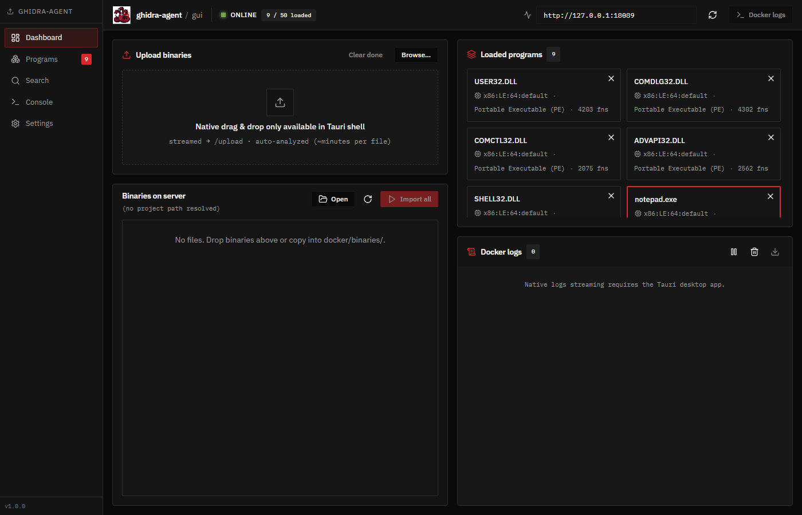
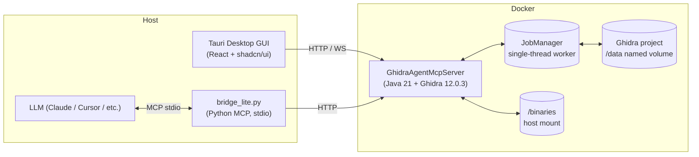
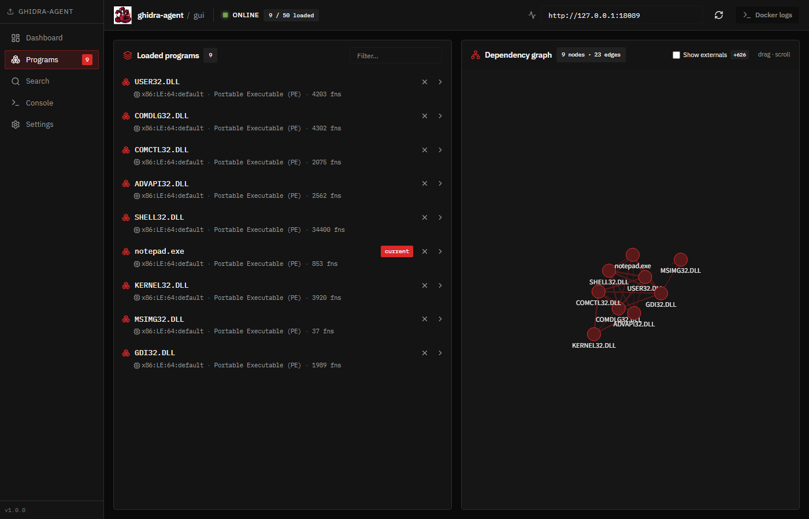
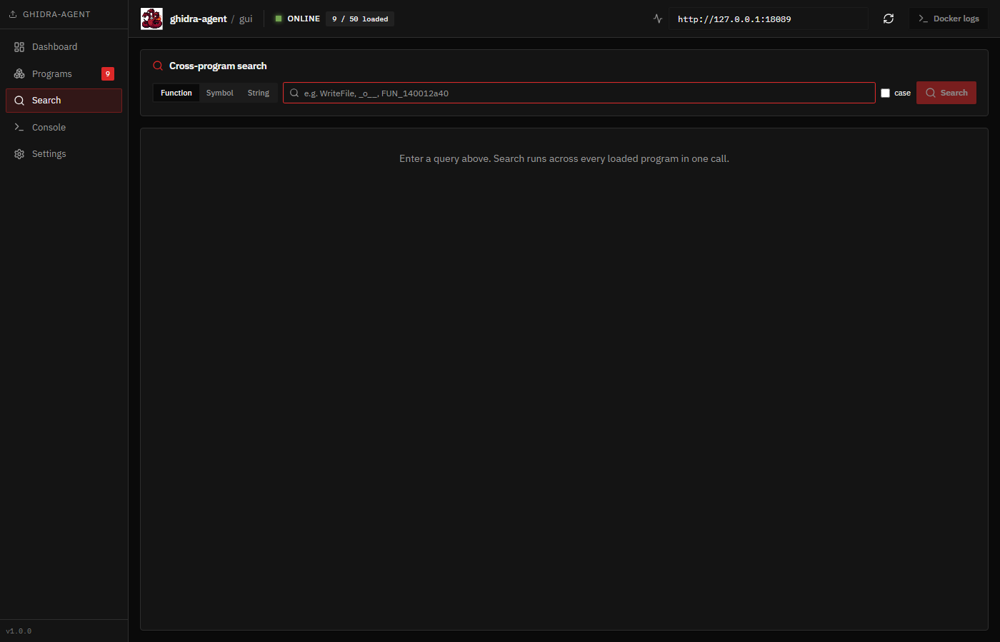
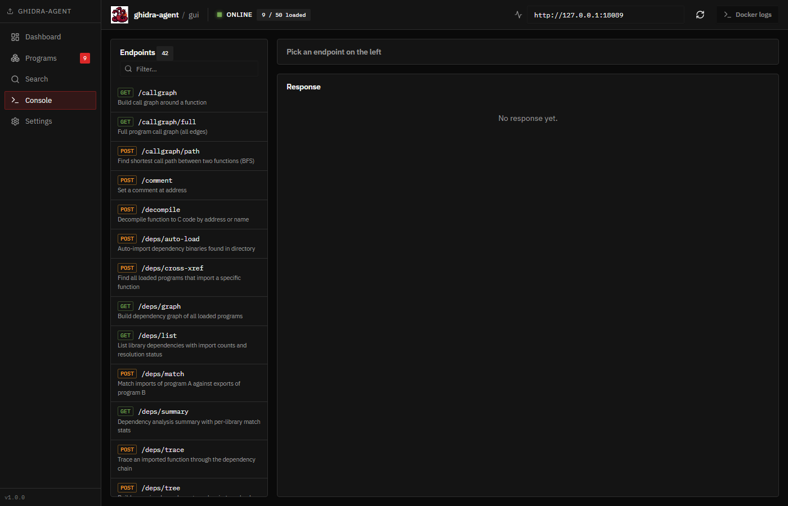
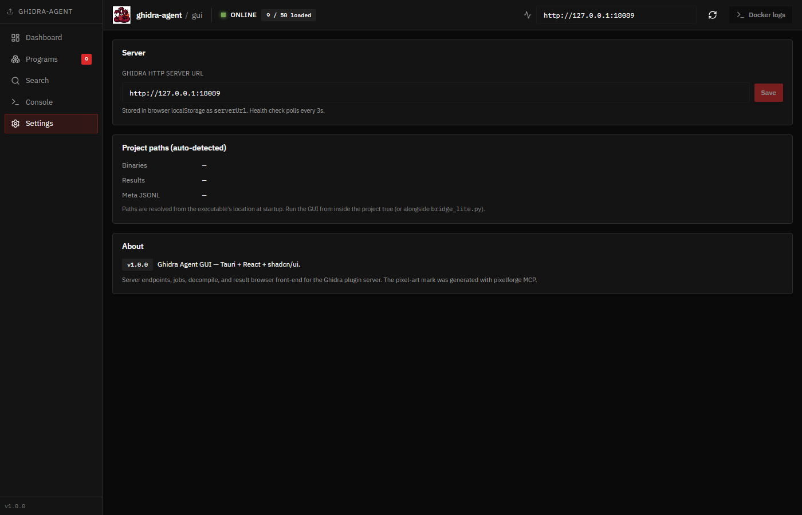

<p align="center">
  
</p>

<h1 align="center">ghidra-agent-mcp</h1>

<p align="center">
  <b>Headless Ghidra binary analysis as an MCP service — with a desktop GUI.</b><br/>
  Run Ghidra in Docker. Drive it from any LLM via Model Context Protocol.<br/>
  Browse the same data interactively in a Tauri desktop app.
</p>

<p align="center">
  <a href="LICENSE"></a>
  <a href="CHANGELOG.md"></a>
  <a href="gui/"></a>
  <a href="bridge_lite.py"></a>
  <a href="https://www.bobong.blog/post/development/ghidra_mcp_path_return"></a>
</p>

<p align="center">
  
</p>

---

## Why this exists

Ghidra is the gold standard for binary analysis — but it's a **Java Swing
desktop app**. Every function lookup, string search, and callgraph trace
happens through clicks. That model breaks the moment you ask:

> _"Look at all 47 DLLs in this malware sample. Which ones import `WriteFile`,
> what's the call chain to user-input handlers, and is anything obfuscated?"_

A human takes hours. An LLM with the right tools can answer in seconds — **if
you give it the tools**.

### The headline: an MCP server for Ghidra

`ghidra-agent-mcp` turns Ghidra into a [Model Context Protocol](https://modelcontextprotocol.io)
server that any modern AI agent can drive. Drop `.mcp.json` into Claude Desktop
/ Claude Code / Cursor / any MCP-aware client, and the agent gets **~40
reverse-engineering tools** out of the box:

```
upload_binary             find_function          callgraph_path
import_binary             search_strings         dependency_tree
decompile_function        search_symbols         dependency_summary
list_imports / strings    match_imports_exports  list_jobs / get_job
batch_import_directory    read_result            list_results
...
```

What you actually get from this:

- **Massively parallel triage.** Hand the agent a folder of unknown binaries
  and ask "which ones look interesting?" — it imports, decompiles, cross-refs
  imports, and ranks them while you make coffee.
- **Cross-binary reasoning.** `match_imports_exports` lets the model trace
  symbols *between* DLLs in one query. No more switching tabs.
- **Stable agent UX, even on big imports.** Long-running jobs return a
  `job_id` and the agent long-polls with `?wait=60` — sessions never time out
  and the model isn't tempted to "just rewrite this in Python" mid-task.
- **Persistent project state.** Imported programs are saved into a Ghidra
  project on a Docker volume and restored on restart. The agent picks up
  exactly where the last conversation left off — no re-analysis.
- **Memory-safe by design.** Every list endpoint is capped + tagged with
  `truncated`/`has_more`. The agent's context window never explodes from one
  bad query.

> **Field report**: practical notes on agent ↔ Ghidra workflows on
> [bobong.blog](https://www.bobong.blog/post/development/ghidra_mcp_path_return).

### Why a GUI on top?

The same HTTP API is also driven by a **Tauri desktop GUI** — and that's not
a "nice to have", it's load-bearing for the LLM workflow:

1. **You need to see what the agent sees.** When the LLM says "the dependency
   chain looks weird around `COMCTL32`", you want to verify visually. The
   GUI's force-directed dependency graph and inline decompiler give you the
   same view as the agent — instant ground truth.
2. **Bulk setup is faster by hand.** Drag 50 binaries onto the dashboard once,
   then converse with the agent across all of them. Going through the LLM for
   data-entry-like tasks is wasteful (and expensive).
3. **No-LLM operation.** The GUI works fully standalone for users who just
   want a friendlier Ghidra. No API keys, no model spend, no rate limits — it's
   just a desktop reverse-engineering tool that happens to also be agent-ready.
4. **Live ops visibility.** Docker logs panel, jobs badge, health status —
   you see the system breathing in real time, which is invaluable when an
   agent run goes sideways and you need to diagnose.

### One stack, two front-ends

| Task | LLM (via MCP) | Human (via GUI) |
|---|---|---|
| Import binary | `upload_binary("/path/to/x.exe")` | drag-and-drop on Dashboard |
| Find a function | `find_function("WriteFile")` | Search tab → Function |
| Decompile | `decompile_function(address=...)` | click a function, side-pane shows C |
| Track long imports | `list_jobs()` / `get_job(id, wait=60)` | `JobsBadge` in status bar |
| Cross-program string lookup | `search_strings("Microsoft")` | Search tab → String |
| See dependency graph | `dependency_summary(program=...)` | Programs page (force-directed view) |
| Browse saved results | `list_results()` / `read_result(path)` | Programs → detail → Results tab |

Both front-ends hit the same Java HTTP server. The agent sees what you see;
you see what the agent sees.

## Architecture



Three components, three deployment artifacts. Each is independently versioned
and runnable, but they're released together as **v1.0.0** in lockstep.

## Quickstart

### Prerequisites

| | Required for | Tested |
|---|---|---|
| Docker Desktop ≥ 4.30 | running the Ghidra server | Win / macOS / Linux |
| Python 3.10+ | LLM bridge (`bridge_lite.py`) | 3.10–3.12 |
| WebView2 Runtime | the GUI (Win10 21H2+ / Win11 ships with it) | — |
| 4 GB RAM available to Docker | analysis | — |
| (only for source builds) Node 20+, Rust 1.78+, Maven 3.9+ | — | — |

### Option A — Portable bundle (recommended for end users)

Download `ghidra-agent-mcp-1.0.0-portable-win-x64.zip` from the
[Releases page](../../releases) and unzip anywhere.

```text
1. Double-click   start.cmd        # boots Docker container + opens the GUI
                                   # first run pulls Ghidra ~400 MB (~5 min)
2. (LLM only)     setup-mcp.cmd    # installs Python deps, prints MCP config
3. To stop:       stop.cmd         # project state preserved on Docker volume
```

The bundle ships everything: prebuilt GUI exe, Docker assets, prebuilt server
JAR, MCP bridge, and helper scripts. No `git clone`, no `mvn`, no `npm`.
See [QUICKSTART.txt](dist-templates/QUICKSTART.txt) inside the bundle for
troubleshooting and per-client config paths (Claude Desktop / Cursor / etc.).

### Option B — From source

```powershell
# Windows
git clone https://github.com/bobongku/ghidra-agent-mcp.git
cd ghidra-agent-mcp
.\deploy.ps1                       # builds image + starts container
cd gui && npm install && npm run tauri dev
```

```bash
# Linux / macOS
git clone https://github.com/bobongku/ghidra-agent-mcp.git
cd ghidra-agent-mcp
docker compose -f docker/docker-compose.yml up -d --build
cd gui && npm install && npm run tauri dev
```

### Verify

```bash
curl http://127.0.0.1:18089/health
# { "status": "ok", "data": { "server": "ghidra-agent-mcp", "version": "1.0.0", ... } }
```

### Drive it from an LLM

Copy `.mcp.json.example` to `.mcp.json` (or use the snippet printed by
`setup-mcp.cmd`) and load it in your MCP client. The bridge registers ~40
tools on connect.

> ⚠️ **Secrets**: `.mcp.json` is in `.gitignore` because it can hold tokens
> for optional tooling MCPs. The Ghidra bridge itself needs no secrets.

## Component overview

### 1. Java server (`docker/`, `src/main/java/`)

A standalone Ghidra plugin that exposes ~45 HTTP endpoints (`/health`,
`/upload`, `/import`, `/decompile`, `/functions`, `/imports`, `/strings`,
`/symbols`, `/callgraph/*`, `/deps/*`, `/search`, `/jobs`, `/jobs/{id}`,
`/schema`, …) backed by Ghidra's headless analysis framework.

Key design choices:
- **Async job system**: `/upload` and `/import` queue work onto a single
  worker thread and return immediately with a `job_id`. Long-poll completion
  via `?wait=N` (server-side max 1800 s). Clients never time out.
- **Project persistence**: imported programs are saved to the on-disk
  Ghidra project (`/data` Docker named volume) and restored on startup.
- **Resource caps everywhere** to prevent OOM on large binaries.
- **Snapshot iteration** of the program map across handlers.

API documented inline by `/schema`.

### 2. Python MCP bridge (`bridge_lite.py`)

Thin stdio MCP server that:
- fetches `/schema` once on startup and registers a tool per endpoint;
- adds curated higher-level tools — `list_jobs`, `get_job`, `find_function`,
  `search_strings`, `search_symbols`, `batch_import_directory`, plus the
  context-saving wrappers (`read_result`, `list_results`).

### 3. Tauri desktop GUI (`gui/`)

Local-first React + shadcn/ui app. Five sidebar pages:

| Page | Screenshot |
|---|---|
| **Dashboard** — drop zone, import panel, loaded programs grid, live Docker logs. |  |
| **Programs** — filterable list paired with an Obsidian-style force-directed dependency graph. |  |
| **Search** — cross-program lookup across functions / symbols / strings; results deep-link into the owning program. |  |
| **Console** — `/schema`-driven endpoint runner with form inputs, JSON viewer, and 50-call history. |  |
| **Settings** — server URL, project paths, version info. |  |

All three components share the same colour palette (Ghidra-flavoured
red/black) and IBM Plex font stack.

## Configuration

| Env var | Default | Where |
|---|---|---|
| `GHIDRA_AGENT_MCP_URL` | `http://127.0.0.1:18089` | Bridge `bridge_lite.py` |
| `GHIDRA_RESULT_DIR` | `./docker/results` | Bridge — large-result spillover |
| `GHIDRA_MCP_PORT` | `8089` | Server (container-side port) |
| `BIND_ADDRESS` | `0.0.0.0` | Server (container-side bind) |
| `GHIDRA_MAX_UPLOAD_BYTES` | `1073741824` (1 GiB) | Server `/upload` cap |
| `AUTO_IMPORT` | `false` | Auto-import every file in `/binaries` on boot |

The host port (`docker-compose.yml`) is bound to `127.0.0.1:18089` by default.
**To expose the server externally**, change the `ports:` line to
`"0.0.0.0:18089:8089"` — but understand that anyone on your network can then
upload arbitrary binaries to be analysed.

### Bundled language extensions

The image baked by `docker/Dockerfile` ships with these Ghidra extensions
pre-installed under `/opt/ghidra/Ghidra/Extensions/`:

| Extension | Version | For | Source |
|---|---|---|---|
| GolangAnalyzerExtension | 1.3.0 | Go binaries (go1.6 – go1.26): symbol/type recovery, `runtime.*`, string slices | [mooncat-greenpy/Ghidra_GolangAnalyzerExtension](https://github.com/mooncat-greenpy/Ghidra_GolangAnalyzerExtension) |
| Kaiju | 260309 | C++ OOAnalyzer (vftable / class recovery), function fingerprinting (CERT/CC, Carnegie Mellon) | [CERTCC/kaiju](https://github.com/CERTCC/kaiju) |

**Rust / Swift / Kotlin (DEX)** are handled by Ghidra 12's built-in demanglers
and the DEX loader. Candidates we surveyed but did not bundle:
[GhidRust](https://github.com/DMaroo/GhidRust) and
[Ayrx/JNIAnalyzer](https://github.com/Ayrx/JNIAnalyzer) ship no release zips
(source-only builds), [ReOxide](https://reoxide.eu/) is a `pip`-installed
decompiler replacement rather than a Ghidra `.zip` extension, and
[felberj/gotools](https://github.com/felberj/gotools) was last released for
Ghidra 9.x. The Dockerfile therefore leaves the `EXT_RUST_*` / `EXT_SWIFT_*`
/ `EXT_DEX_*` slots empty — supply URL+SHA256 via `--build-arg` if a
12.0.3-compatible release appears.

URLs and SHA256 are pinned to **Ghidra 12.0.3**. If you bump `GHIDRA_VERSION`
in the Dockerfile, you must also update each extension's `EXT_*_URL` /
`EXT_*_SHA256` to a release that targets the new Ghidra version — Ghidra
extensions are tightly version-coupled.

To skip the bundled extensions entirely:

```sh
docker compose -f docker/docker-compose.yml build \
    --build-arg INSTALL_LANG_EXTENSIONS=false
```

To add another extension at build time, supply the URL and SHA256 via build
args, e.g. for a Rust analyzer:

```sh
docker compose -f docker/docker-compose.yml build \
    --build-arg EXT_RUST_URL=https://example.com/rust-ext.zip \
    --build-arg EXT_RUST_SHA256=<sha256>
```

To layer extensions onto an already-built image without rebuilding, drop
`.zip` files into `./extensions/` and uncomment the `./extensions:/extensions`
line in `docker/docker-compose.yml`. They are unpacked on container start by
`docker/install-extensions.sh`.

## Workflow examples

### As an LLM

```
1. health()                                # see what's loaded
2. batch_import_directory("/binaries")     # queue everything in a directory
3. list_jobs()                             # watch the queue drain
4. find_function("CreateProcess")          # which binaries / what addresses
5. decompile_function(address=..., program="kernel32.dll")
6. dependency_summary(program="notepad.exe")
7. read_result(file_path)                  # drill into a saved compact result
```

### As a human (GUI)

1. **Dashboard** → drag binaries into the drop zone (auto-uploads + analyses).
2. **Programs** → see the dependency graph form between loaded files.
3. **Search** → "WriteFile" → click → drops you into KERNEL32 → Functions tab,
   pre-filtered, decompile auto-running.
4. **Console** → run `/callgraph?address=...&depth=3` interactively.

## Workflow at a glance

<p align="center">
  
</p>

The Programs view is the centerpiece for human users — a filterable list of
loaded binaries on the left, a live force-directed dependency graph on the
right. Click any node to jump straight to that program's detail page.

## Project layout

```
ghidra-agent-mcp/
├─ src/main/java/                  # Java HTTP server (Ghidra plugin)
│   ├─ GhidraAgentMcpServer.java   # entry, route table
│   ├─ ServerContext.java          # programs map, locks, project, JobManager
│   ├─ Job.java / JobManager.java  # background worker + history
│   ├─ {Program,Function,Listing,Modify,Dependency,CallGraph,
│       DataType,Schema,Search,Jobs}Handler.java
│   └─ ...
├─ docker/
│   ├─ Dockerfile                  # eclipse-temurin:21-jre + Ghidra 12.0.3
│   ├─ docker-compose.yml
│   ├─ entrypoint.sh
│   ├─ ghidra-agent-mcp.jar        # pre-built server jar
│   ├─ binaries/                   # mount: drop your binaries here
│   └─ results/                    # mount: large analysis results
├─ bridge_lite.py                  # Python MCP bridge (stdio)
├─ gui/
│   ├─ src/                        # React + shadcn/ui
│   │   ├─ pages/                  # Dashboard / Programs / ProgramDetail / Search / Console / Settings
│   │   ├─ components/             # reusable UI + feature panels
│   │   ├─ hooks/                  # useHealthPolling / useJobs / useResultsWatcher
│   │   └─ lib/                    # api / bridge / types / utils
│   └─ src-tauri/                  # Rust backend (commands + watcher + docker logs streamer)
├─ prepare.ps1                     # one-shot Docker boot + container up + binary import
├─ deploy.ps1                      # build / no-build / clean modes
├─ pom.xml                         # Maven (Java server)
├─ LICENSE / CHANGELOG.md / ATTRIBUTION.md
└─ README.md
```

## Building from source

### Server jar

```bash
# requires Maven; uses ~/.m2/repository/ghidra/* (install Ghidra jars first)
mvn package
cp target/ghidra-agent-mcp.jar docker/

# or build inside a maven container (no host install):
docker run --rm \
  -v $(pwd):/proj -v ~/.m2:/root/.m2 -w /proj \
  maven:3.9-eclipse-temurin-21 mvn -q clean package
```

### GUI

```bash
cd gui
npm install
npm run build           # web bundle in dist/
npm run tauri build     # native installer in src-tauri/target/release/bundle/
```

## Distribution

### Portable bundle (recommended for end users)

```powershell
.\build-portable.ps1            # full: mvn + tauri + bundle + zip
.\build-portable.ps1 -SkipBuilds   # reuse existing artifacts, just re-bundle
```

Output (`dist/ghidra-agent-mcp-<version>-portable-win-x64.zip`, ~5 MB) contains:

```
ghidra-agent-gui.exe        Tauri standalone (16 MB)
start.cmd / stop.cmd        Container lifecycle
setup-mcp.cmd               LLM bridge configuration
docker/                     Compose + Dockerfile + prebuilt JAR
bridge_lite.py              Python MCP bridge
QUICKSTART.txt              One-screen setup guide
```

End user only needs Docker Desktop. No git, no Python (unless wiring an LLM),
no Maven, no Node.

### Native installers

`npm run tauri build` (run inside `gui/`) produces, on each host platform:

- **Windows**: `.msi` (WiX) and `.exe` (NSIS) installers
- **macOS**: `.dmg` and a `.app` bundle
- **Linux**: `.deb` and `.AppImage`

These end up under `gui/src-tauri/target/release/bundle/`. The Java server jar
inside `docker/ghidra-agent-mcp.jar` is OS-agnostic.

## Versioning

All three components are released together. The current version is in
[CHANGELOG.md](CHANGELOG.md) and exposed at runtime by:

- `/health` → `data.version`
- GUI sidebar footer
- `package.json` / `Cargo.toml` / `pom.xml`

## License

Apache 2.0 — see [LICENSE](LICENSE).
This project is built on Ghidra (also Apache 2.0, NSA) and a number of
open-source dependencies — full credits in [ATTRIBUTION.md](ATTRIBUTION.md).
